# UVM SPI I2C Verification

SPI와 I2C Master/Slave RTL을 설계하고 UVM 환경에서 기능을 검증한 프로젝트입니다. Vivado 기본 시뮬레이션으로 프로토콜 동작을 먼저 확인한 뒤, VCS와 Verdi 환경에서 Scoreboard 기반 데이터 정합성 검증과 Functional Coverage를 수행했습니다. 마지막으로 Basys 3 보드와 Logic Analyzer를 사용해 실제 신호를 확인했습니다.

- 개발 기간: 2026.06.11 ~ 2026.06.18
- 설계 언어: Verilog HDL, SystemVerilog
- 검증 방법론: UVM
- 개발 및 검증 환경: Xilinx Vivado, Synopsys VCS, Synopsys Verdi
- 하드웨어: Xilinx Basys 3, Logic Analyzer
- 주요 결과: SPI 1,732건과 I2C 1,564건 모두 PASS, Functional Coverage 100%

## 1. 프로젝트 목표

- SPI와 I2C 통신 규격에 맞는 Master/Slave RTL을 구현합니다.
- Sequence, Driver, Monitor, Scoreboard, Coverage로 구성된 재사용 가능한 UVM 검증 환경을 구축합니다.
- 랜덤 데이터, 경계값, 전이 패턴, 속도 구간을 사용해 정상 동작과 예외 가능성을 확인합니다.
- Scoreboard로 기대값과 실제값을 자동 비교하고 Functional Coverage로 검증 완료도를 확인합니다.
- 시뮬레이션 결과를 FPGA와 Logic Analyzer 실측 결과로 다시 확인합니다.

## 2. 검증 환경

Sequence에서 만든 Sequence Item은 Sequencer를 거쳐 Driver로 전달됩니다. Driver는 Interface를 통해 DUT 입력을 구동하고, Monitor는 전송 완료 시점의 결과를 Transaction으로 수집합니다. 수집된 값은 Analysis Port를 통해 Scoreboard와 Coverage로 동시에 전달됩니다.

- Sequence Item: 입력 데이터와 제어 정보를 Transaction 단위로 정의합니다.
- Sequence: 랜덤, 경계값, 전체 범위, Cross 시나리오를 생성합니다.
- Driver: Transaction을 Interface 신호로 변환해 DUT를 구동합니다.
- Monitor: DUT의 완료 시점과 송수신 데이터를 수집합니다.
- Scoreboard: 기대값과 실제 수신값을 비교해 PASS와 FAIL을 집계합니다.
- Coverage: 데이터 패턴, 전이, 속도, 명령 종류와 분포를 측정합니다.
- Config DB: Virtual Interface를 Testbench 하위 Component에 전달합니다.

## 3. SPI 설계 및 검증

SPI는 CPOL 0, CPHA 0인 Mode 0으로 구성했습니다. Master가 SCLK와 Slave Select를 생성하며, MOSI와 MISO를 통해 8비트 데이터를 동시에 송수신합니다. Master와 Slave는 IDLE, START, DATA, STOP 상태를 따라 동작합니다.

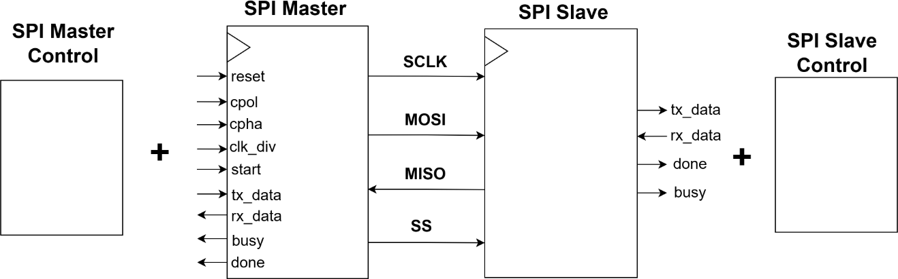

- MOSI: Master 송신 데이터와 Slave 수신 데이터를 비교합니다.
- MISO: Slave 송신 데이터와 Master 수신 데이터를 비교합니다.
- clk_div: 2, 4, 8, 16, 32, 64, 128, 255를 사용해 전송 속도를 나눕니다.
- Sampling: Mode 0 기준으로 상승 Edge에서 데이터를 Sampling하고 하강 Edge에서 다음 데이터를 출력합니다.
- Transfer: MSB부터 8비트를 Full-duplex 방식으로 전송합니다.

### SPI UVM 구조

SPI Sequence Item은 clk_div, m_tx_data, s_tx_data를 포함합니다. Monitor가 전송 완료 시점의 m_rx_data와 s_rx_data를 수집하면 Scoreboard와 Coverage가 동일한 Transaction을 받아 결과를 계산합니다.

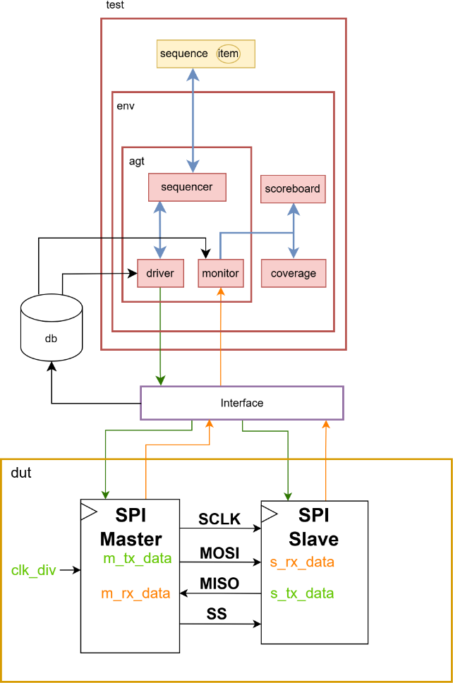

### SPI 검증 시나리오

- Random Test: clk_div와 Master/Slave 송신 데이터를 무작위로 생성합니다.
- Direct Test: 00, FF, AA, 55와 Walking 1 패턴을 순차 전송합니다.
- Full Test: Master 데이터 0부터 255까지 전 범위를 전송하고 Slave 데이터는 반전값으로 설정합니다.
- Cross Test: 8종의 clk_div와 12종의 데이터 패턴을 조합해 속도와 데이터 Cross Coverage를 채웁니다.

### SPI 검증 결과

- Master → Slave: **866 PASS, 0 FAIL**
- Slave → Master: **866 PASS, 0 FAIL**
- FAST 구간: 402 PASS, 0 FAIL
- NORMAL 구간: 247 PASS, 0 FAIL
- SLOW 구간: 217 PASS, 0 FAIL
- Functional Coverage: **100%**

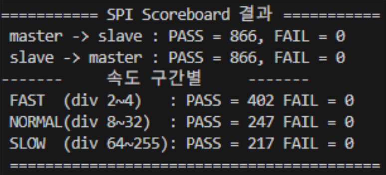

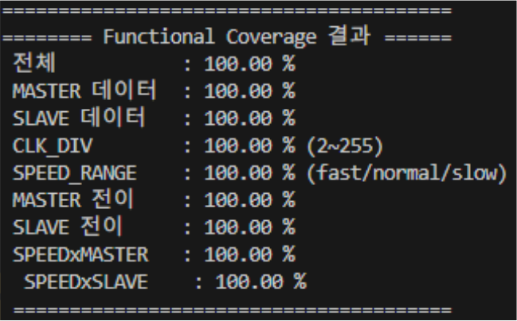

## 4. I2C 설계 및 검증

I2C는 SCL과 Open-drain SDA를 공유하는 Half-duplex 구조로 구현했습니다. Master는 START, WRITE, READ, STOP 명령을 수행하고, Slave는 7비트 주소 0x50을 비교한 뒤 ACK와 데이터를 응답합니다.

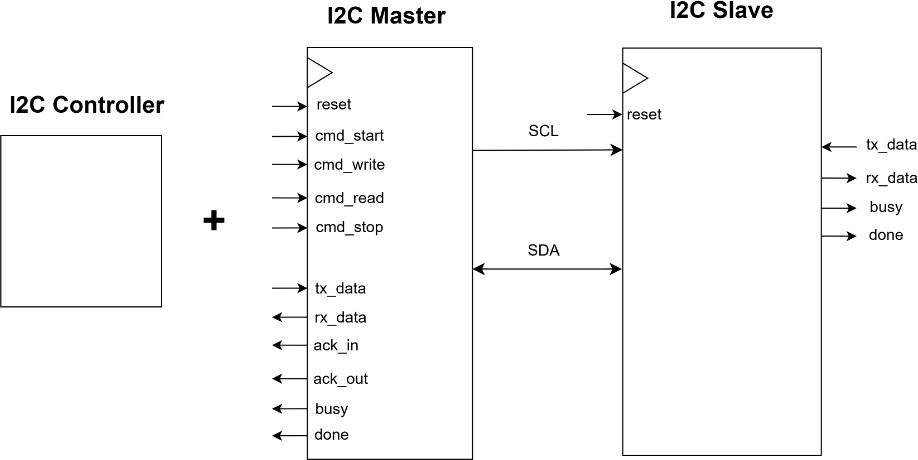

- START: SCL이 High인 상태에서 SDA를 High에서 Low로 전환합니다.
- Address: 7비트 주소와 R/W 비트를 전송합니다.
- WRITE: Master 송신 데이터와 Slave 수신 데이터를 비교합니다.
- READ: Slave 응답 데이터와 Master 수신 데이터를 비교합니다.
- ACK: 수신 측의 응답 비트를 확인합니다.
- STOP: SCL이 High인 상태에서 SDA를 Low에서 High로 전환합니다.

### I2C UVM 구조

I2C Sequence Item은 cmd_start, cmd_write, cmd_read, cmd_stop과 Master/Slave 송신 데이터를 포함합니다. Monitor는 Command를 먼저 저장한 뒤 m_done 시점의 결과를 수집해 주소 Phase와 데이터 Phase를 구분합니다.

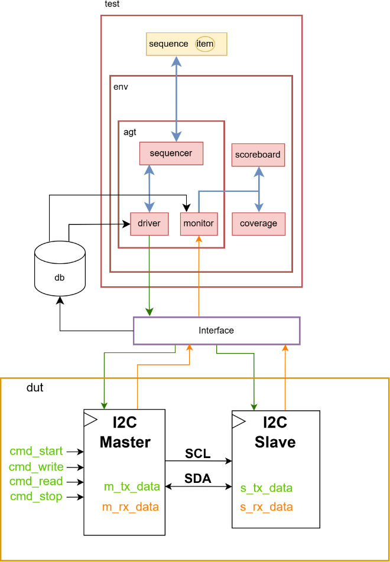

### I2C 검증 시나리오

- WRITE/READ Test: 양방향 Transaction을 500회 이상 무작위로 반복합니다.
- Boundary Test: 00, FF, 80, 01, AA, 55, 7F, FE를 전송해 경계값과 비트 전이를 확인합니다.
- Command Coverage: START, WRITE, READ, STOP 실행 여부를 확인합니다.
- Data Coverage: Master와 Slave 송신 데이터를 0부터 255까지 10개 구간으로 나누어 분포를 확인합니다.

### I2C 검증 결과

- WRITE: **782 PASS, 0 FAIL**
- READ: **782 PASS, 0 FAIL**
- 전체: **1,564 PASS, 0 FAIL**
- Functional Coverage: **100%**

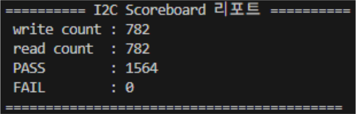

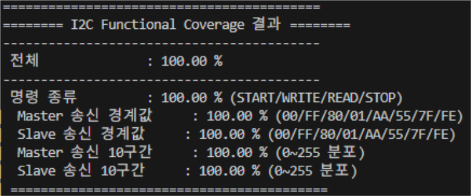

## 5. Logic Analyzer 및 FPGA 확인

UVM 검증 후 Basys 3 보드 두 대를 Master와 Slave로 구성하고 실제 통신 신호를 확인했습니다. SPI는 SCLK, MOSI, MISO, Slave Select를 측정했고, I2C는 SCL과 SDA에서 START, Address, ACK, Data, STOP 순서를 확인했습니다.

### SPI 실측

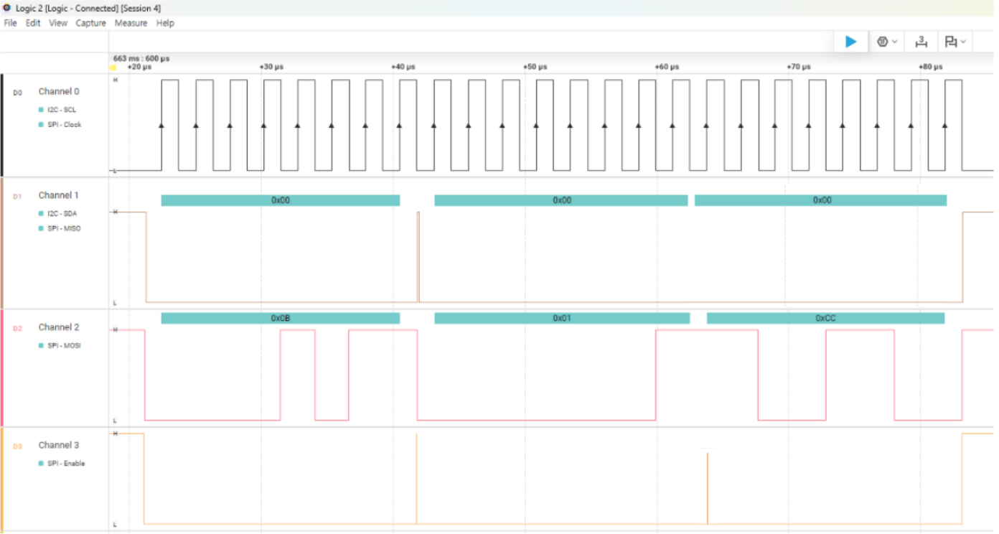

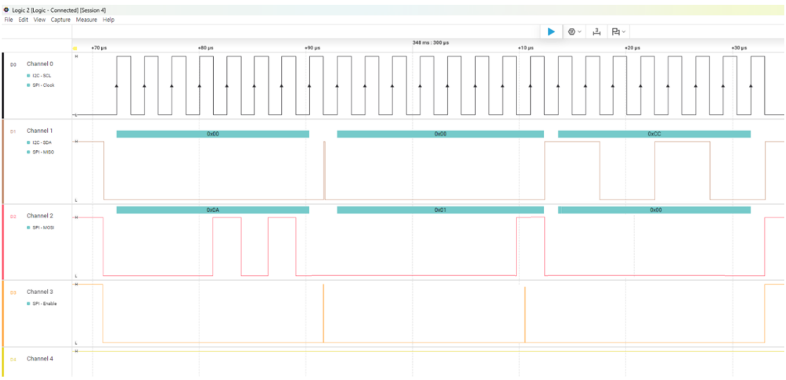

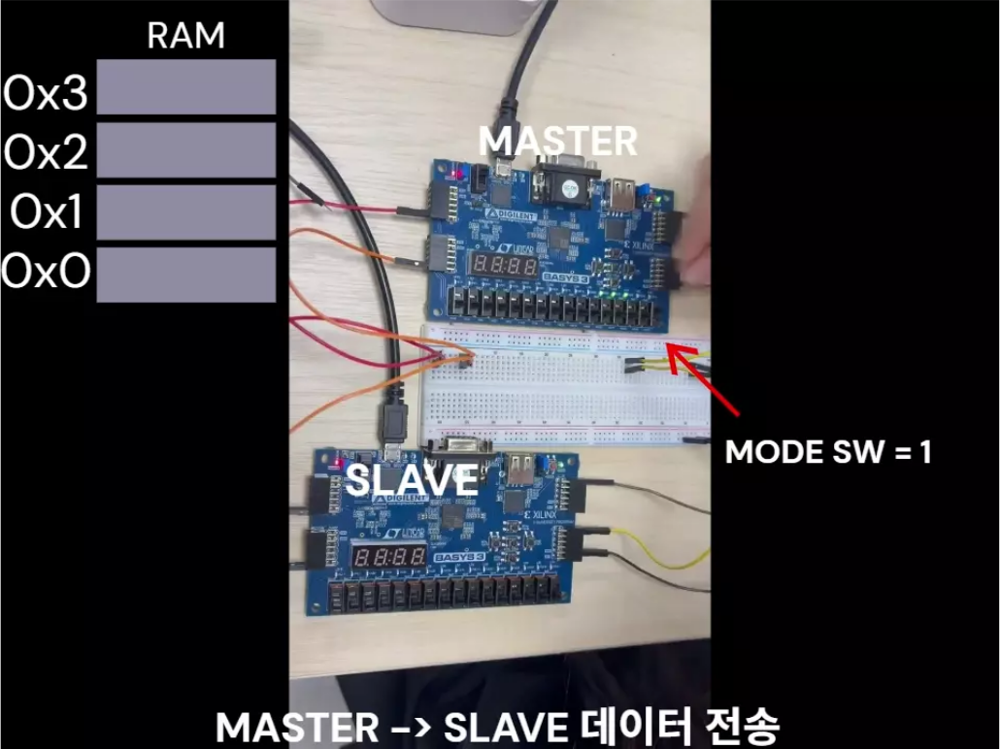

### I2C 실측

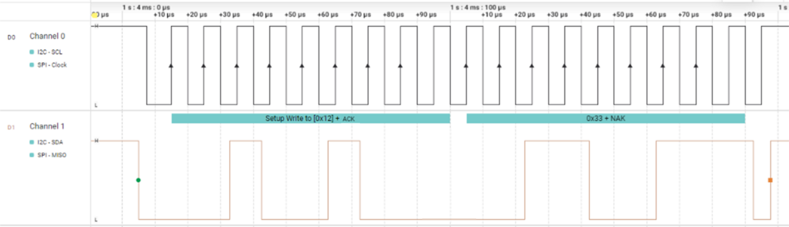

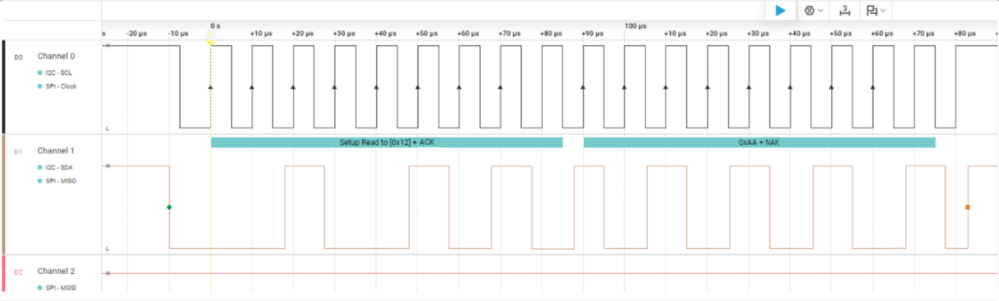

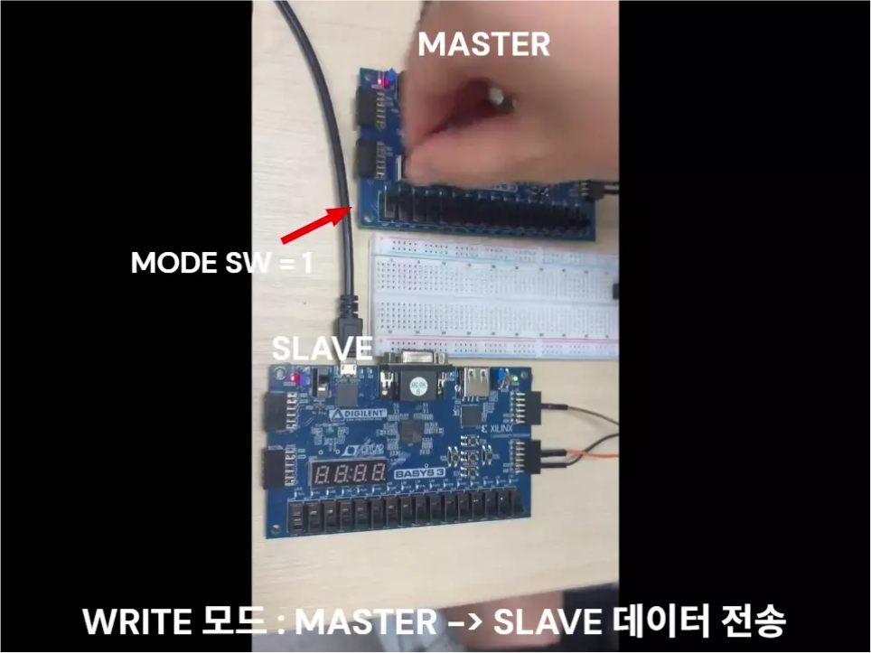

## 6. Troubleshooting

I2C UVM 검증 중 첫 번째 START Transaction에서 Driver가 m_done을 계속 기다리며 진행이 멈추는 문제가 발생했습니다.

- 문제: reset 해제 직후 cmd_start가 구동되어 DUT가 첫 Command를 인식하지 못했습니다.
- 분석: Verdi 파형을 사용할 수 없는 상황에서 UVM_INFO 로그로 Command 구동 시점과 done 대기 구간을 추적했습니다.
- 해결: Driver가 Command를 구동하기 전에 Clocking Block 기준 대기 구간을 추가했습니다.
- 결과: START 이후 WRITE, READ, STOP이 순차적으로 수행되고 Scoreboard와 Coverage까지 정상 종료되었습니다.

이 과정에서 Driver와 DUT 사이의 시간 정렬이 UVM Transaction 진행에 직접 영향을 준다는 점을 확인했습니다. 디버깅 로그는 UVM_HIGH로 설정해 필요한 경우에만 확인할 수 있도록 구성했습니다.

## 7. 디렉터리 구성

- uvm/spi/rtl
  - SPI Master, Slave, Top RTL
- uvm/spi/tb
  - SPI Interface, Sequence Item, Sequence, Driver, Monitor, Agent, Scoreboard, Coverage, Environment, Test, Testbench Top
- uvm/i2c/rtl
  - I2C Master, Slave, Top RTL
- uvm/i2c/tb
  - I2C Interface, Sequence Item, Sequence, Driver, Monitor, Agent, Scoreboard, Coverage, Environment, Test, Testbench Top
- implementation/spi
  - Vivado 기본 시뮬레이션과 FPGA 구현용 SPI 소스
- implementation/i2c
  - Vivado 기본 시뮬레이션과 FPGA 구현용 I2C 소스
- docs/images
  - 블록 구조, UVM 구조, 검증 결과, Logic Analyzer, FPGA 이미지

## 8. UVM Simulation

### SPI

1. uvm/spi/rtl의 SystemVerilog 파일을 Design Source에 추가합니다.
2. uvm/spi/tb를 Include 경로로 지정합니다.
3. spi_if.sv, spi_pkg.sv, tb_top.sv 순서로 Testbench를 Compile합니다.
4. Simulation Top을 tb_top으로 설정합니다.
5. UVM Test Name을 spi_full_cov_test로 지정해 전체 시나리오를 실행합니다.

### I2C

1. uvm/i2c/rtl의 SystemVerilog 파일을 Design Source에 추가합니다.
2. uvm/i2c/tb를 Include 경로로 지정합니다.
3. i2c_if.sv, i2c_pkg.sv, tb_top.sv 순서로 Testbench를 Compile합니다.
4. Simulation Top을 tb_top으로 설정합니다.
5. UVM Test Name을 i2c_basic_test로 지정해 WRITE/READ와 Boundary 시나리오를 실행합니다.

FSDB 파형을 생성하려면 Verdi 연동 환경이 필요합니다. UVM 컴포넌트는 각 Protocol의 Package 파일에서 Compile 순서에 맞게 Include됩니다.
